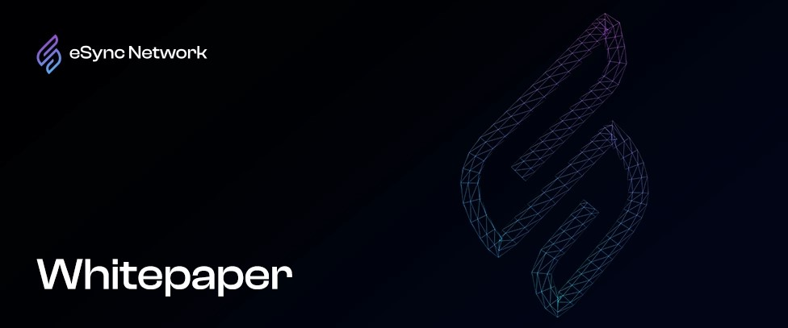

# eSync Network Whitepaper – Unleashing Real-World Blockchain Solutions

Welcome to the code repository for the **eSync Network Whitepaper**.
 
eSync Network is a pioneering Layer 1 Blockchain, the chain that evolved from the former eCredits Blockchain (used to run on the PoA consensus mechanism), meticulously designed to bridge the gap between the theoretical potential of web3 projects and practical application in the real world. At its core, eSync Network is a testament to the seamless integration of advanced blockchain technology with everyday life. The eSync platform, underpinned by the robust Ethereum Virtual Machine (EVM) framework, offers a fertile ground for innovation across various sectors.
 
The eSync Network's native coin is eCredits (ECS).
 
The Whitepaper can be subject to change.
 
Updates will be published in this repository regularly.

| title               | version | date       | description                     |
|---------------------|---------|------------|---------------------------------|
| eCredits Whitepaper | 1.0     | 2021-08-03 | first version of whitepaper     |
| eCredits Whitepaper | 1.01    | 2021-08-03 | fix typos and others            |
| eCredits Whitepaper | 2.0     | 2021-11-17 | restructure and content changes |
| eSync Whitepaper    | 1.0     | 2024-03-28 | Introducing evolved chain       |

**[Download Whitepaper](eSync-whitepaper.pdf)**